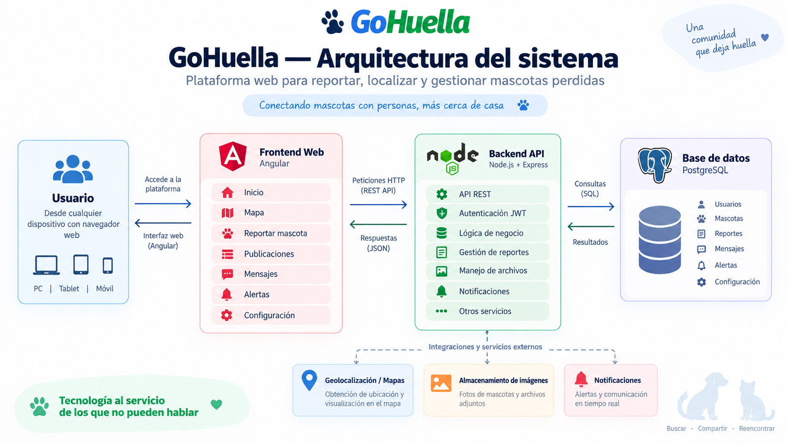
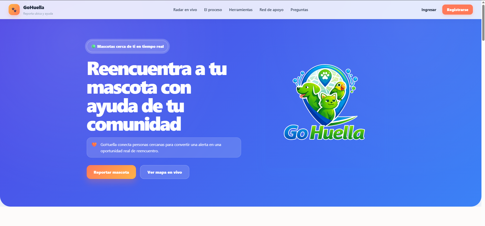
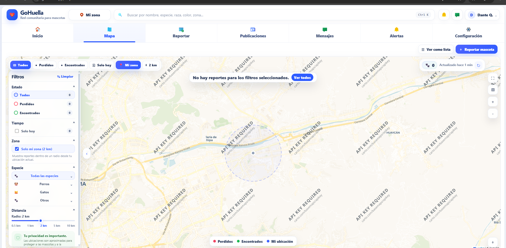
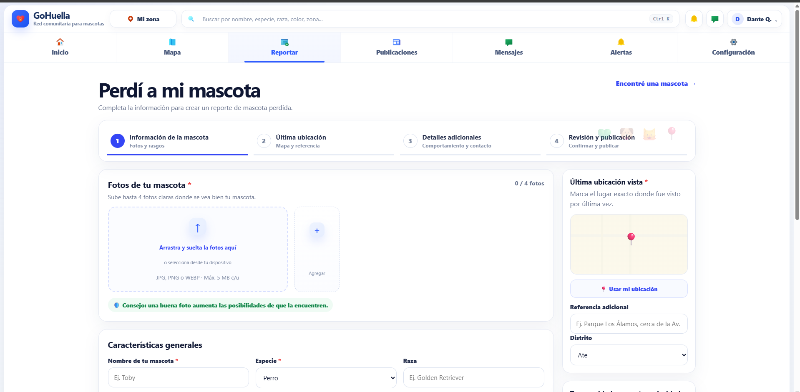
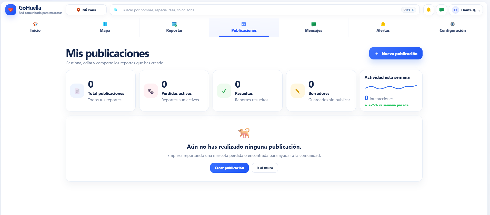
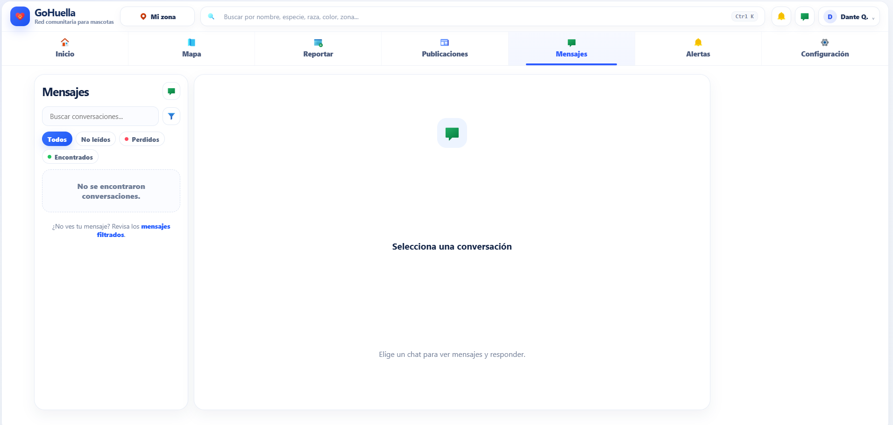
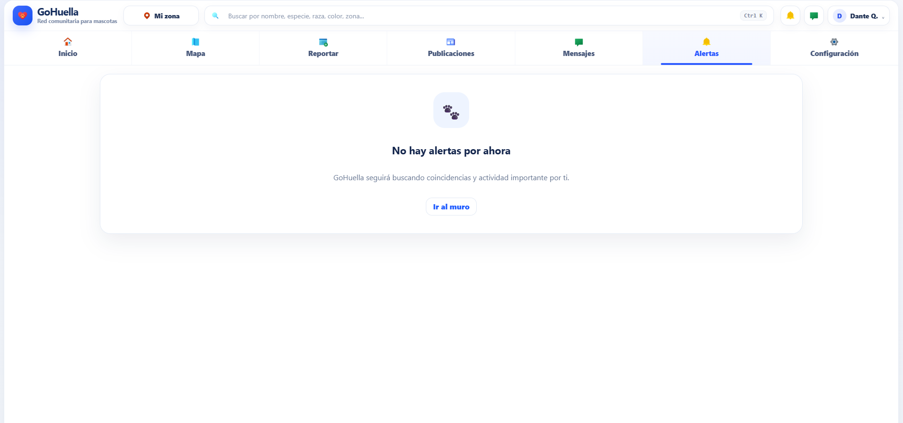
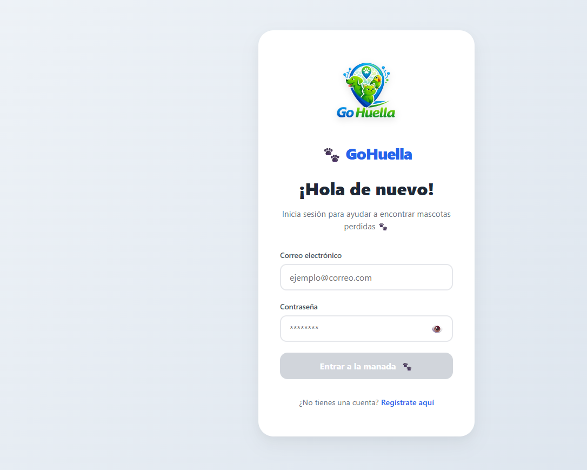

# 🐾 GoHuella

### Plataforma web para reportar, localizar y gestionar mascotas perdidas


GoHuella es una plataforma web orientada a la **búsqueda y reencuentro
de mascotas perdidas**, utilizando geolocalización, reportes
comunitarios, publicaciones y comunicación entre usuarios.

El sistema permite registrar mascotas perdidas o encontradas, visualizar
reportes cercanos, consultar información mediante mapas y facilitar la
comunicación entre las personas involucradas.

------------------------------------------------------------------------

## 🎯 Problema

Cuando una mascota se pierde, la información suele difundirse mediante
diferentes redes sociales, grupos de mensajería o publicaciones
independientes.

Esto puede dificultar:

-   Encontrar reportes cercanos.
-   Identificar rápidamente una mascota.
-   Conocer su última ubicación.
-   Mantener organizada la información.
-   Contactar con la persona que realizó el reporte.

GoHuella busca centralizar este proceso dentro de una plataforma
orientada a la comunidad.

------------------------------------------------------------------------

## 💡 Solución

GoHuella permite crear y consultar reportes de mascotas perdidas o
encontradas utilizando información como:

-   Fotografías.
-   Nombre.
-   Especie.
-   Raza.
-   Características.
-   Ubicación.
-   Fecha del reporte.
-   Estado del caso.
-   Información adicional.

Los usuarios pueden explorar los casos disponibles, utilizar filtros y
consultar reportes próximos a su zona.

------------------------------------------------------------------------

## 🌐 Demo

👉 **[GoHuella --- Demo](https://www.gohuella.app/)**

Aplicación web funcional para explorar la plataforma, consultar el mapa,
crear reportes de mascotas perdidas o encontradas y probar el flujo
general del sistema.

------------------------------------------------------------------------

## 🏗️ Arquitectura del sistema

GoHuella utiliza una arquitectura web cliente-servidor, separando la
interfaz de usuario, la API, la lógica de negocio y la persistencia de
datos.

### Flujo general

``` text
┌──────────────────────┐
│       Usuario        │
│ PC · Tablet · Móvil  │
└──────────┬───────────┘
           │
           ▼
┌──────────────────────┐
│   Angular Frontend   │
│      TypeScript      │
└──────────┬───────────┘
           │
           │ HTTP / REST API
           ▼
┌──────────────────────┐
│   Node.js + Express  │
│      Backend API     │
├──────────────────────┤
│ Autenticación JWT    │
│ Lógica de negocio    │
│ Gestión de reportes  │
│ Usuarios             │
│ Mensajes             │
│ Alertas              │
└──────────┬───────────┘
           │
           │ SQL
           ▼
┌──────────────────────┐
│     PostgreSQL       │
│                      │
│ Usuarios             │
│ Mascotas             │
│ Reportes             │
│ Mensajes             │
│ Alertas              │
│ Configuración        │
└──────────────────────┘
           │
           ▼
┌─────────────────────────────┐
│ Servicios / integraciones   │
│                             │
│ 🗺️ Geolocalización           │
│ 📸 Imágenes                  │
│ 🔔 Notificaciones            │
└─────────────────────────────┘
```

### Diagrama de arquitectura



------------------------------------------------------------------------

## 🚀 Funcionalidades principales

### 🐾 Reportes de mascotas

-   Registrar mascotas perdidas.
-   Registrar mascotas encontradas.
-   Agregar fotografías.
-   Registrar características de la mascota.
-   Registrar última ubicación conocida.
-   Agregar referencias adicionales.
-   Gestionar el estado del reporte.

### 🗺️ Geolocalización

-   Visualización de reportes en un mapa.
-   Consulta de casos cercanos.
-   Selección de zona de interés.
-   Filtro por distancia.
-   Visualización de la ubicación asociada a un reporte.

### 🔎 Búsqueda y filtros

Permite buscar y filtrar reportes por:

-   Estado.
-   Especie.
-   Distancia.
-   Fecha.
-   Zona.
-   Casos recientes.
-   Casos cercanos.

### 📢 Publicaciones

Los usuarios pueden gestionar sus propios reportes y publicaciones.

Incluye información como:

-   Total de publicaciones.
-   Mascotas perdidas activas.
-   Casos resueltos.
-   Borradores.
-   Actividad de publicaciones.

### 💬 Mensajería

Sistema de comunicación entre usuarios para facilitar el contacto
relacionado con los reportes.

### 🔔 Alertas

Sistema orientado a informar al usuario sobre actividad relevante y
posibles coincidencias relacionadas con sus reportes.

### 👤 Autenticación

-   Registro de usuarios.
-   Inicio de sesión.
-   Autenticación mediante JWT.
-   Gestión de sesión.
-   Control de acceso.

### ⚙️ Configuración

Gestión de preferencias y configuración asociada al usuario.

------------------------------------------------------------------------

## 📸 Capturas de pantalla

Las capturas utilizadas para documentar el proyecto se encuentran en la
carpeta `docs/`.

### 🏠 Página principal



### 🗺️ Mapa de reportes



### 📢 Reportar mascota



### 📰 Publicaciones



### 💬 Mensajes



### 🔔 Alertas



### 🔐 Inicio de sesión



------------------------------------------------------------------------

## 🛠️ Tecnologías

### Frontend

-   Angular 19
-   TypeScript
-   HTML5
-   CSS3
-   Angular Router
-   Formularios
-   Consumo de APIs REST
-   Componentes reutilizables

### Backend

-   Node.js
-   Express.js
-   JavaScript
-   API REST
-   JWT
-   Middleware
-   Validación de solicitudes
-   Gestión de archivos

### Base de datos

-   PostgreSQL
-   SQL
-   Relaciones entre entidades
-   Consultas y operaciones CRUD

### Integraciones

-   Servicios de mapas y geolocalización
-   Gestión de imágenes
-   Sistema de notificaciones
-   APIs externas

### Herramientas

-   Git
-   GitHub
-   Visual Studio Code
-   Postman
-   npm

------------------------------------------------------------------------

## 🔐 Seguridad

El sistema incorpora mecanismos orientados a proteger el acceso y la
información de los usuarios.

Entre ellos:

-   Autenticación mediante JWT.
-   Protección de endpoints.
-   Middleware de autenticación.
-   Separación de responsabilidades entre frontend y backend.
-   Variables de entorno para configuración sensible.
-   Validación de solicitudes.

Las credenciales, tokens y configuraciones sensibles no forman parte del
repositorio público.

------------------------------------------------------------------------

## 📂 Estructura del repositorio público

``` text
gohuella/
│
├── docs/
│   ├── gohuella-arquitectura.png
│   ├── gohuella-inicio.png
│   ├── gohuella-mapa.png
│   ├── gohuella-reportar.png
│   ├── gohuella-publicaciones.png
│   ├── gohuella-mensajes.png
│   ├── gohuella-alertas.png
│   └── gohuella-login.png
│
└── README.md
```

La implementación completa del frontend y backend se mantiene en
repositorios privados.

------------------------------------------------------------------------

## 🔒 Código fuente

La implementación completa del sistema se mantiene privada.

Componentes principales:

-   `gohuella-frontend`
-   `gohuella-backend`
-   Base de datos PostgreSQL
-   Servicios e integraciones externas

Este repositorio público funciona como **presentación técnica del
proyecto**, incluyendo documentación, arquitectura, tecnologías,
capturas y material demostrativo.

------------------------------------------------------------------------

## 🧩 Módulos principales

``` text
GoHuella
│
├── Inicio
├── Mapa
├── Reportar mascota
├── Publicaciones
├── Mensajes
├── Alertas
└── Configuración
```

### Flujo principal

``` text
Reportar mascota
       │
       ▼
Información de mascota
       │
       ▼
Última ubicación
       │
       ▼
Detalles adicionales
       │
       ▼
Revisión
       │
       ▼
Publicación
       │
       ▼
Comunidad
       │
       ├── Búsqueda
       ├── Mapa
       ├── Coincidencias
       ├── Mensajes
       └── Alertas
```

------------------------------------------------------------------------

## 🎯 Objetivos técnicos

El proyecto fue desarrollado con los siguientes objetivos:

-   Construir una aplicación web completa.
-   Diseñar una arquitectura frontend/backend.
-   Crear y consumir APIs REST.
-   Implementar autenticación mediante JWT.
-   Trabajar con una base de datos relacional.
-   Implementar operaciones CRUD.
-   Integrar geolocalización.
-   Gestionar imágenes y archivos.
-   Crear interfaces web responsivas.
-   Implementar filtros y búsqueda.
-   Separar responsabilidades entre las diferentes capas del sistema.

------------------------------------------------------------------------

## 📈 Estado del proyecto

**MVP funcional --- en desarrollo continuo.**

El proyecto continúa evolucionando en aspectos relacionados con:

-   Experiencia de usuario.
-   Geolocalización.
-   Gestión de reportes.
-   Comunicación entre usuarios.
-   Sistema de alertas.
-   Validación de información.
-   Nuevas funcionalidades para la comunidad.

------------------------------------------------------------------------

## 👨‍💻 Desarrollo

Proyecto desarrollado como parte de mi portafolio personal para
demostrar experiencia práctica en:

-   Desarrollo Backend.
-   Desarrollo Full Stack.
-   APIs REST.
-   Bases de datos.
-   Autenticación.
-   Integración de servicios.
-   Desarrollo de aplicaciones web.
-   Diseño de soluciones orientadas a problemas reales.

------------------------------------------------------------------------

## 📚 Aprendizajes

Durante el desarrollo del proyecto trabajé conceptos relacionados con:

-   Arquitectura de aplicaciones web.
-   Separación Frontend / Backend.
-   Diseño y consumo de APIs REST.
-   Autenticación y autorización.
-   Persistencia de datos.
-   Modelado de bases de datos.
-   Geolocalización.
-   Gestión de archivos.
-   Manejo de estados.
-   Componentización en Angular.
-   Desarrollo de funcionalidades end-to-end.

------------------------------------------------------------------------

## 🔮 Próximas mejoras

Algunas mejoras consideradas para futuras versiones:

-   Sistema de coincidencias más avanzado.
-   Mejoras en geolocalización.
-   Notificaciones en tiempo real.
-   Optimización de búsquedas.
-   Mejoras de rendimiento.
-   Aplicación móvil.
-   Nuevas herramientas para organizaciones y refugios.
-   Estadísticas y analítica de reportes.

------------------------------------------------------------------------

## 📌 Nota

GoHuella es un **proyecto personal de desarrollo de software** creado
con fines de aprendizaje, demostración técnica y construcción de
portafolio.

El proyecto busca explorar cómo diferentes tecnologías web pueden
utilizarse para resolver un problema real mediante una plataforma
centralizada.

------------------------------------------------------------------------

## 📬 Contacto

**Dante Quispe**

-   💼 [LinkedIn](https://www.linkedin.com/in/dante-quispe-461001334/)
-   🐙 [GitHub](https://github.com/devbydante)

------------------------------------------------------------------------

⭐ Gracias por visitar el proyecto.

🐾 **GoHuella --- Tecnología para ayudar a reencontrar a quienes dejan
huella.**
